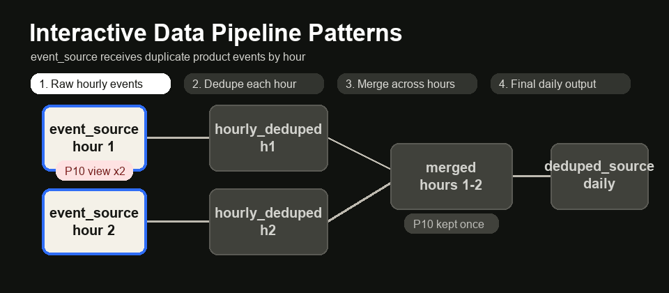

# Interactive Data Pipeline Patterns

Interactive, browser-based explainers for three practical data engineering pipeline patterns. Each page is designed to make the pattern understandable visually first, then reinforce it with business context, Postgres-style SQL, table definitions, and before/after dummy data.



Preview: the microbatch explainer shows raw hourly events getting deduped, merged across hours, and published as a clean daily table.

## What Is Included

| Page | File | Pattern |
|---|---|---|
| Microbatch Hourly Deduped | `microbatch_dedup_animation.html` | Dedupe events hourly, then merge across hours |
| Little Book of Pipelines | `little_book_pipelines_animation.html` | Group many upstream sources into a shared schema and metadata catalog |
| Cumulative Table Design | `cumulative_table_design_animation.html` | Build rolling user/entity history using daily facts plus yesterday's snapshot |

Each page includes:

- Animation-first explanation
- Step-by-step interactive controls
- Business scenario and end goal
- Practical use cases
- How the pattern saves time and money
- When to use it and when not to use it
- Explicit source, intermediate, and final table flow
- Postgres-style SQL examples
- `CREATE TABLE` statements
- Before/after tables with color-coded changes
- Syntax-highlighted SQL blocks

## How To Open

No build step is required. These are static HTML files.

Open any file directly in a browser:

```bash
open microbatch_dedup_animation.html
open little_book_pipelines_animation.html
open cumulative_table_design_animation.html
```

Or open the project folder in VS Code and use a static server extension.

## Recommended GitHub Pages Setup

If publishing with GitHub Pages:

1. Push this repo to GitHub.
2. Go to repo Settings.
3. Open Pages.
4. Set source to the main branch.
5. Serve from the root directory.

Then the pages will be available at URLs like:

```text
https://YOUR_USERNAME.github.io/interactive-data-pipeline-patterns/microbatch_dedup_animation.html
https://YOUR_USERNAME.github.io/interactive-data-pipeline-patterns/little_book_pipelines_animation.html
https://YOUR_USERNAME.github.io/interactive-data-pipeline-patterns/cumulative_table_design_animation.html
```

## Pattern Summaries

### Microbatch Hourly Deduped

Use this when raw events arrive hourly and duplicates can appear both inside a single hour and across neighboring hours.

Flow:

```text
event_source
  -> hourly_deduped_source
  -> merged hourly_deduped_source partitions
  -> deduped_source
```

The visual explains how each hour is deduped first, then merged in rounds until there is one clean daily output.

### Little Book of Pipelines

Use this when many upstream sources feed the same analytical domain and backfills, ownership, and data quality are getting hard to manage.

Flow:

```text
crm_customers + billing_accounts
  -> item_group_book
  -> intermediate_dataset
```

The visual explains how source groups, a shared schema, and a small metadata catalog make large pipelines easier to operate.

### Cumulative Table Design

Use this when you need rolling metrics, such as DAU, WAU, MAU, or 7-day/30-day action counts, without rescanning many days of raw events every run.

Flow:

```text
events
  -> active_users_daily
  -> active_users_cumulated
```

The visual explains how today's daily facts are combined with yesterday's cumulative snapshot to produce today's new cumulative snapshot.

## Credits

These explainers are educational visualizations inspired by the following public repositories and patterns:

- **Microbatch Hourly Deduped Tutorial** by Zach Wilson  
  Source: [EcZachly/microbatch-hourly-deduped-tutorial](https://github.com/EcZachly/microbatch-hourly-deduped-tutorial)

- **Little Book of Pipelines Example** by Zach Wilson  
  Source: [EcZachly/little-book-of-pipelines](https://github.com/EcZachly/little-book-of-pipelines)

- **Cumulative Table Design** by DataExpert.io  
  Source: [DataExpert-io/cumulative-table-design](https://github.com/DataExpert-io/cumulative-table-design)

The HTML pages in this repo are original interactive explainers created for learning and practice. The underlying pipeline ideas and teaching patterns are credited above.

## Notes

- SQL examples are written in Postgres-style syntax for readability.
- Some original source repositories use Hive, Spark, Presto, or Trino syntax. The examples here intentionally translate the ideas into a more approachable Postgres-style form.
- The dummy data is intentionally small so the transformations are easy to follow.
